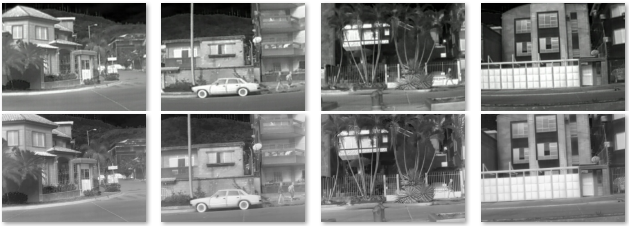
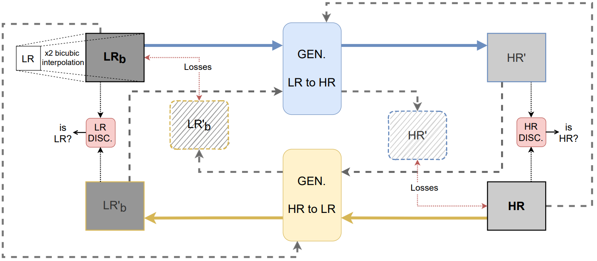
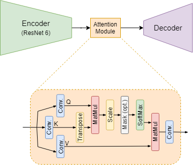
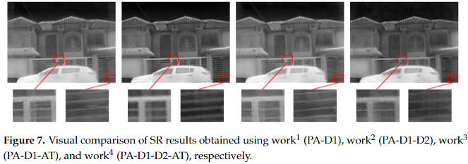

# Unsupervised Approach for Thermal Image Super-Resolution domain.

A transfer domain strategy, from a low-resolution image to a high-resolution domain is presented using a CycleGAN architecture, with a ResNet as an encoder in the generator with an attention module after the encoder stage. The proposed approach is trained with a large dataset acquired using three thermal cameras at different resolutions.

# Dataset

This architecture is trained with a large dataset acquired using three thermal cameras at different resolutions. Available in http://www.cidis.espol.edu.ec/es/content/dataset-lr-mr-hr-far-infrared-image.

  

# Architecture

  

  

# Quantitative Results

| Approaches | PSNR | SSIM |
| --- | --- | --- |
| Our Previous Work | 22.42 | 0.7989 |
| NPU-MPI-LAB | 21.96 | 0.7618 |
| SVNIT-NTNU-2 | 21.44 | 0.7758 |
| ULB-LISA | 22.32 | 0.7899 |
| Current Work1 (PA-D1) | 22.98 | 0.7991 |
| Current Work2 (PA-D1-D2) | 21.93 | 0.8117 |
| Current Work3 (PA-D1-AT) | 23.19 | 0.8023 |
| Current Work4 (PA-D1-D2-AT) | 21.23 | 0.8167 |

# Qualitative Results

  

