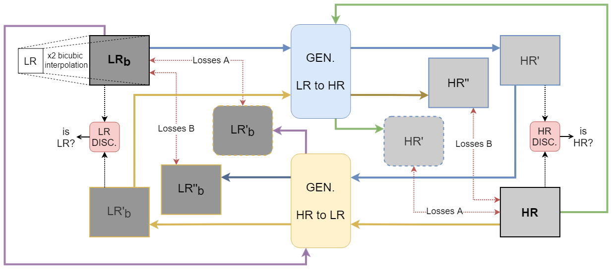

# Unsupervised Approach for Thermal Image Super-Resolution domain.

A transfer domain strategy, from a low-resolution image to a high-resolution domain is presented using a CycleGAN architecture, with a ResNet as an encoder in the generator with an attention module after the encoder stage. The proposed approach is trained with a large dataset acquired using three thermal cameras at different resolutions.

# Dataset

This architecture is trained with a large dataset acquired using three thermal cameras at different resolutions. Available in http://www.cidis.espol.edu.ec/es/content/dataset-lr-mr-hr-far-infrared-image.

  

# Architecture

  

  

# Results

| Approaches | PSNR | SSIM |
| --- | --- | --- |
| A | 0.00 | 0.0000 |
| B | 0.00 | 0.0000 |
| C | 0.00 | 0.0000 |
